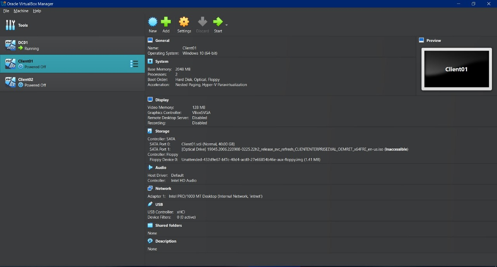
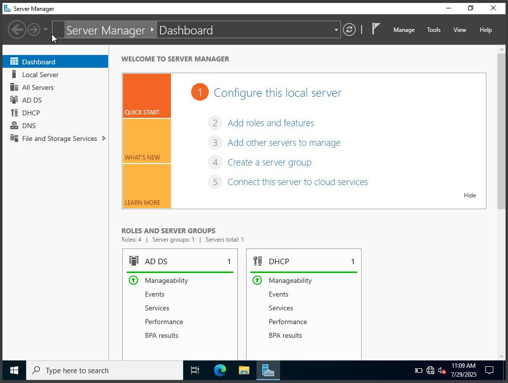
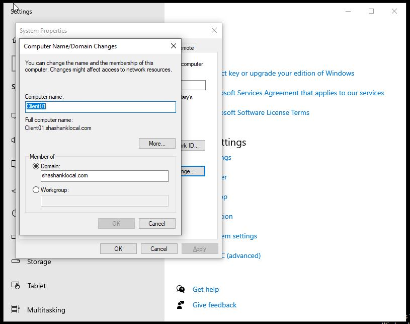
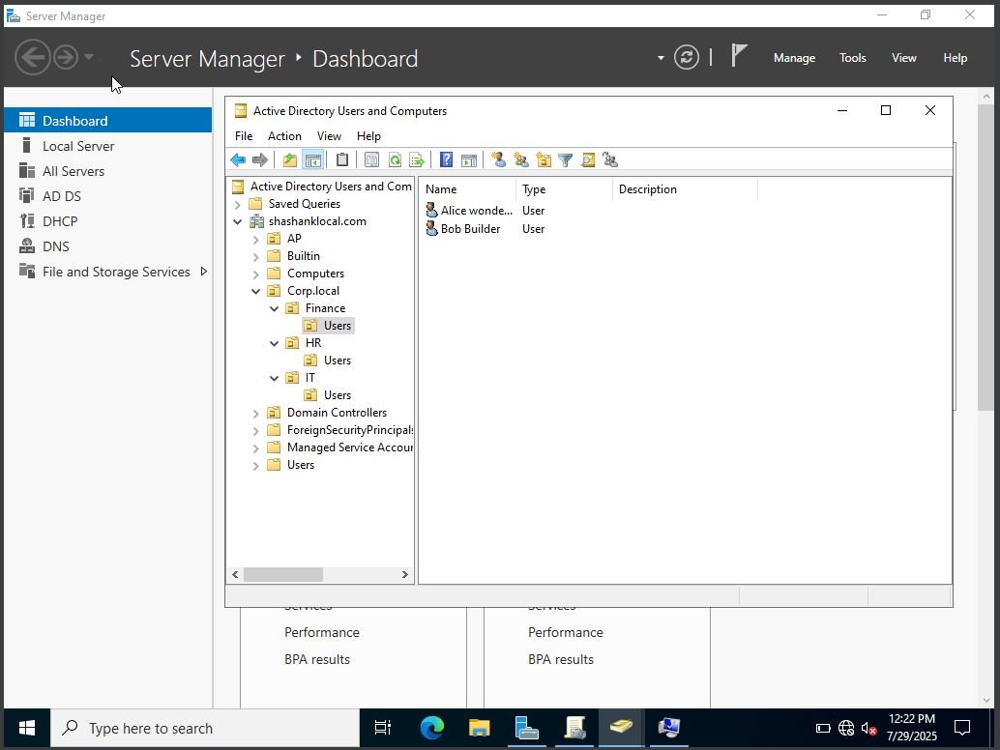
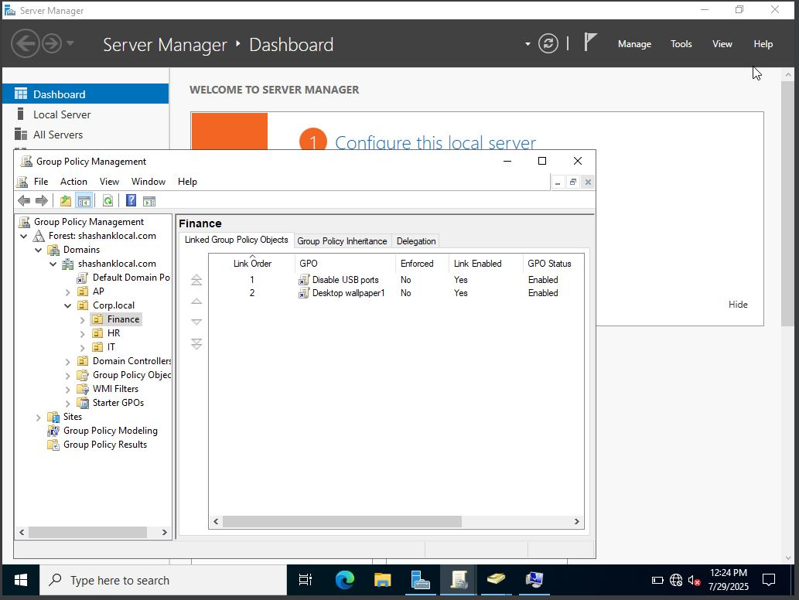
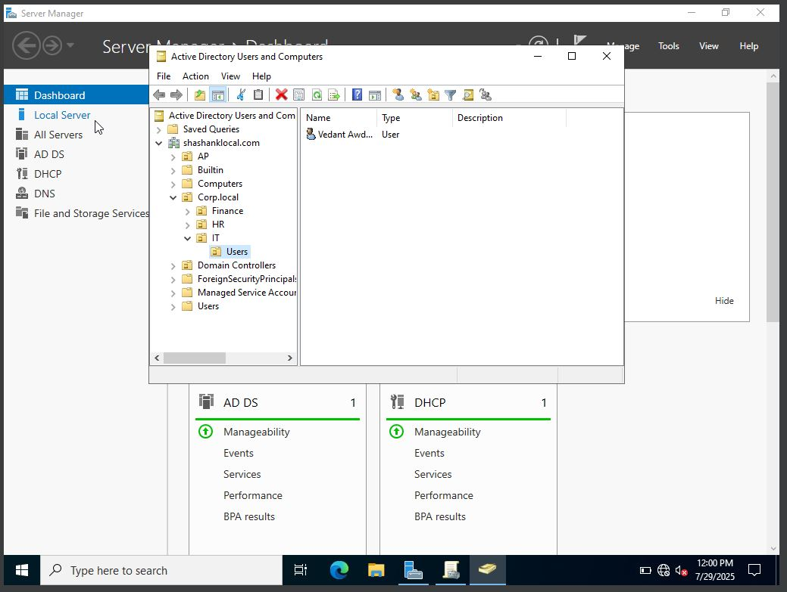
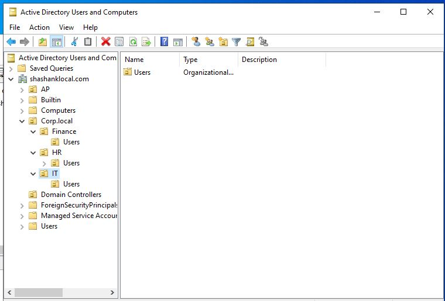
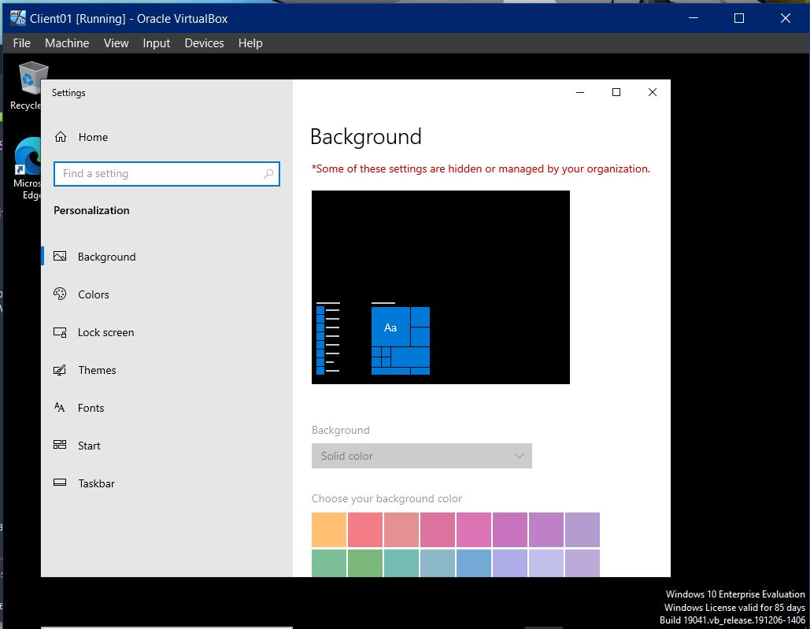

# Active Directory & Group Policy Implementation Lab

## 🧠 Objective
Simulate a small enterprise network by setting up a Windows Server domain controller, joining client machines, managing users/OUs, and enforcing GPOs.

## 🛠️ Tools Used
- VirtualBox (Oracle)
- Windows Server 2022
- Windows 10 (Client VMs)
- Group Policy Management Console (GPMC)
- Active Directory Users & Computers (ADUC)

## 🔄 Project Phases

### ✅ Phase 1: Environment Setup
- Installed VirtualBox, created 1 DC01 VM + 2 Client VMs.

- Configured networking and static IPs.

### ✅ Phase 2: Domain Controller Configuration
- Promoted Server to DC using AD DS.
- Created `shashank.local` domain.

### ✅ Phase 3–6: Domain Join, User/OU Setup, GPOs
- Joined clients to domain.

- Created OUs (HR, IT, Finance), users, and security groups.

- Implemented GPOs: password policy, login restrictions, wallpaper setting, etc.

### ✅ Phase 7: Validation & Documentation
- Verified GPOs using `gpresult` and `rsop.msc`.
- Attached screenshots and documented structure.

## 📷 Screenshots
- [x] Domain Controller Setup

- [x] OU/User/Group Creation

- [x] GPO Implemented for client machines

## ✅ Outcome
Hands-on experience with:
- Active Directory Management
- GPO Enforcement & Validation
- Simulated Enterprise Network

## 📂 Documentation
Refer to the `/docs` folder for all screenshots and configuration steps.

---

👤 Author: Shashank Awadhoot  
📧 Email: shashankawadhoot8967@gmail.com   
🔗 LinkedIn: https://www.linkedin.com/in/shashank-awdhoot-139b06225/
